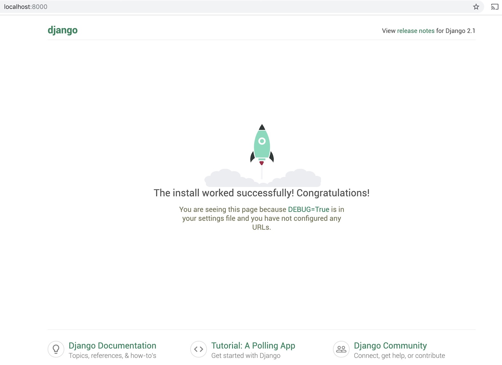

### Elastic APM Workshop - PyCon 2019 - Bogotá

### Prerequisites:
* Install Docker Compose - https://docs.docker.com/compose/install/
* Create a free account at Elastic Cloud with a 14-day trial period - https://cloud.elastic.co
* Click `Create Deployment` to create a cluster.

Copy the APM Server URL
<kbd></kbd>


Copy the Token
<kbd></kbd>


### 1 - Environment set-up

First step is to have the Django app up and running.

<p align="center">
    <kbd>
    
    </kbd>
</p>


Now add `APM_SERVER_URL` and `APM_SECRET_TOKEN` from your cluster at Elastic cloud at `docker-compose.yml`:
```yaml
...
    environment:
        APM_SERVER_URL: changeme
        APM_SECRET_TOKEN: changeme
        APM_SERVICE_NAME: pycon2019
```

#### Run the django app with `docker-compose`:

```shell
docker-compose build
docker-compose up
```
You must see a welcome page at http://localhost:8000

<kbd></kbd>


### 2 - Data load

#### Creating our `models.py`

Create the `models.py` file at `myproject/myproject/models.py`

Movies dataset with the following structure:

```python
from django.db import models

class Movie(models.Model):
    id = models.PositiveIntegerField(primary_key=True)
    title = models.CharField(max_length=255)
    genre = models.CharField(max_length=128)
    original_language = models.CharField(max_length=3)
    overview = models.TextField()
    release_date = models.DateField()
    runtime = models.DecimalField(max_digits=10, decimal_places=2)
    tagline = models.CharField(max_length=255)

class Actor(models.Model):
    id = models.PositiveIntegerField(primary_key=True)
    name = models.CharField(max_length=100)

class Role(models.Model):
    role_name = models.CharField(max_length=100)
    actor = models.ForeignKey('Actor',on_delete=models.CASCADE)
    movie = models.ForeignKey('Movie',on_delete=models.CASCADE)
    
    def movie_title(self):
        return self.movie.title
    def actor_name(self):
        return self.actor.name 
```


Create the database migrations:
```
docker exec -it djangoapp python manage.py makemigrations myproject
```

Apply the migrations:
```
docker exec -it djangoapp python manage.py migrate
```

Load the database dump:
```
docker exec -it djangoapp python manage.py loaddata db.json
```

Access the admin interface at http://localhost:8000/admin
```
username: admin
password: admin
```

Lets add the admin interface for the models, on `pycon2019-app/myproject/myproject/admin.py`:

```python
from django.contrib import admin

from myproject.models import Movie, Actor, Role


class ActorAdmin(admin.ModelAdmin):
    search_fields = ['name']
    list_display = ['name']

admin.site.register(Actor, ActorAdmin)

class MovieAdmin(admin.ModelAdmin):
    ordering = ['-release_date']
    search_fields = ['title']
    list_display = ('title', 'tagline')

admin.site.register(Movie, MovieAdmin)

class RoleAdmin(admin.ModelAdmin):
    search_fields = ['role_name', 'movie__title', 'actor__name']
    list_display = ['role_name', 'movie_title', 'actor_name']
    
admin.site.register(Role, RoleAdmin)


```

You should have the admin working by now, and check your APM in kibana.
Lets make a webpage now.


### 3 - A webpage


Create `myproject/myproject/views.py`:
```python
from django.http import HttpResponse
from django.template import loader
from myproject.models import Actor, Role, Movie
import requests
import json


def index(request):
    search_query = request.GET.get('search_box', None)
    template = loader.get_template('index.html')
    context = {}

    if request.method == 'GET' and search_query is not None: 

        actor = Actor.objects.get(name__icontains=search_query)
        roles = Role.objects.get(actor=actor)
        
        r = requests.get('https://api.duckduckgo.com/?q=%s&format=json'%search_query)
        response = json.loads(r.text)

        context = {
            'actor': actor,
            'actor_image': response['Image'],
            'roles': roles
        }

    return HttpResponse(template.render(context, request))

```

Create `myproject/templates/index.html`
```html
<html>

<body>
      <div class="flex one center demo">
            <form type="get" action="." style="margin: 50px">
                  <input id="search_box" type="text" name="search_box" placeholder="Search...">
                  <button id="search_submit" type="submit">Submit</button>
            </form>

            <h1 class="flex one center">{{actor.name}}</h1>

            <div style="width: 200px;">

                  <label>
                        
                  </label>
            </div>

      </div>
      <link rel="stylesheet" href="https://unpkg.com/picnic">
</body>

</html>
```

Change `myproject/myproject/urls.py`:
```
from django.contrib import admin
from django.urls import path
from myproject.views import index

urlpatterns = [
    path('admin/', admin.site.urls),
    path('', index)
]
```

The page should be accesible on http://localhost:8000/
